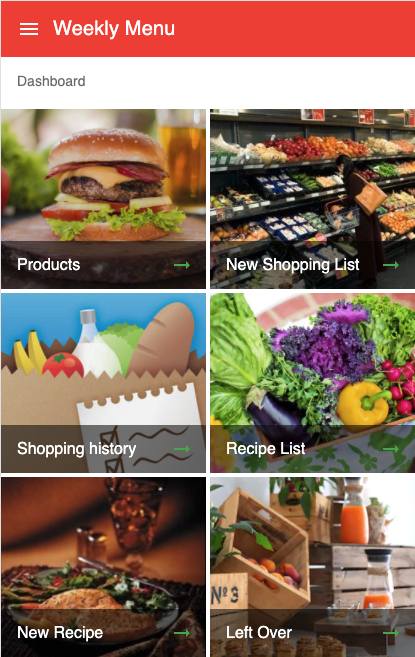
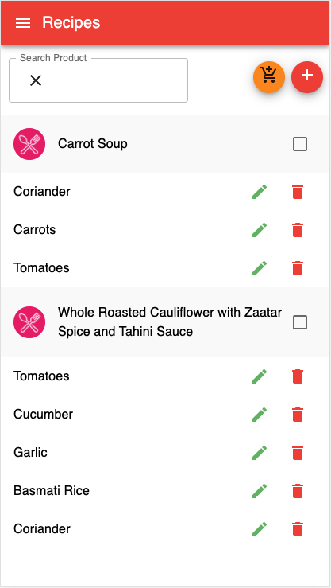
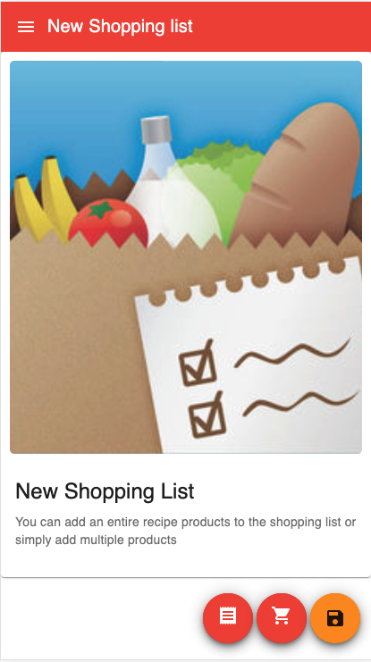
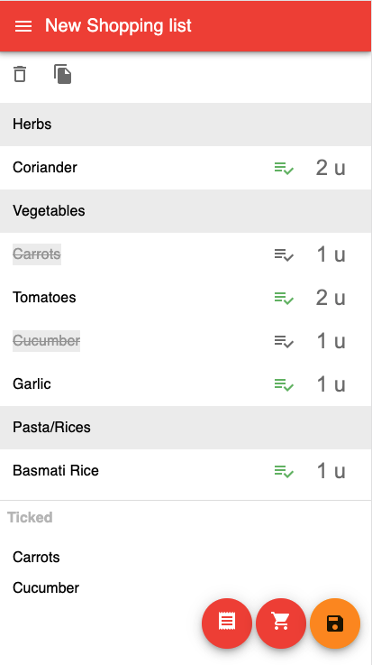

[](https://github.com/eliasjunior/weekly-menu-react/actions/workflows/main.yml)

# Weekly Menu UI

<br />
<p align="center">
  <a href="https://github.com/eliasjunior/weekly-menu-react/blob/master/public/favicon.png">
    
  </a>

  <h3 align="center">Weekly Menu</h3>

  <p align="center">
    It's a web application to make the shopping list from recipes.
    <br />
    <br />
  </p>
</p>
<!-- TABLE OF CONTENTS -->
<details open="open">
  <summary>Table of Contents</summary>
  <ol>
    <li>
      <a href="#about-the-project">About The Project</a>
      <ul>
        <li><a href="#built-with">Built With</a></li>
      </ul>
    </li>
    <li>
      <a href="#getting-started">Getting Started</a>
      <ul>
        <li><a href="#prerequisites">Prerequisites</a></li>
        <li><a href="#installation">Installation</a></li>
      </ul>
    </li>
    <li><a href="#usage">Usage</a></li>
  </ol>
</details>

<!-- ABOUT THE PROJECT -->

## About The Project

<p align="center" >
    <a href="https://github.com/eliasjunior/weekly-menu-react/blob/master/docs/img/dashboard.png">
        
    </a>
     <a href="https://github.com/eliasjunior/weekly-menu-react/blob/master/docs/img/recipes.png">
        
    </a>
    <a href="https://github.com/eliasjunior/weekly-menu-react/blob/master/docs/img/shopping-list.png">
        
    </a>
    <a href="https://github.com/eliasjunior/weekly-menu-react/blob/master/docs/img/pick-list.png">
        
    </a>
</p>

</br>

## Getting Started

### Prerequisites

* Download [NodeJS](https://nodejs.org)  and follow the steps.

* Server app [Weekly-menu](https://github.com/eliasjunior/weekly-menu)

### Installation

<li><a href="https://github.com/eliasjunior/weekly-menu-react" target="_blank">Source Code</a></li>

1. Clone the Weekly-menu-react App
   ```sh
   git clone https://github.com/eliasjunior/weekly-menu-react.git
   ```
2. Install NPM packages, run the command bellow.
   ```sh
   npm install
   ```
